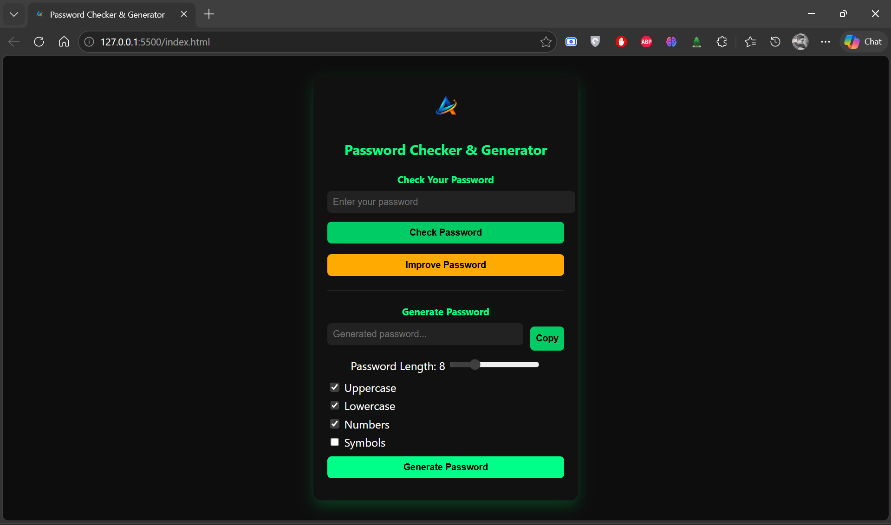

# Password Generator & Checker

## Overview
This project was built after my 12th standard as a task given by my uncle, who is an IT professional.
The goal was to move beyond basic applications and build something more practical, secure, and feature-focused.
This application allows users to generate strong passwords and also check the strength of existing passwords.

## Features
- Generate strong random passwords
- Check password strength
- Support for uppercase, lowercase, numbers, and symbols
- Clean and modern UI
- Real-time feedback on password strength

## Tech Stack
- HTML
- CSS
- JavaScript

## What I Learned
- Implementing logic for secure password generation
- Understanding password strength criteria
- Improving UI to a more modern and professional level
- Writing cleaner and more structured code

## 📸 Screenshots

## How to Run
1. Clone or download this repository
2. Open `index.html` in your browser

## Project Level
Intermediate (Practical & Feature-Focused)

## Note on Logo Usage
The logo used in this project is my personal brand identity.  
It is included only for demonstration purposes and should not be reused, redistributed, or used in other projects without permission.

## Growth Note
This project represents the final stage in this phase of my journey, where I focused on building a more complete, real-world application with better UI, logic, and usability.
